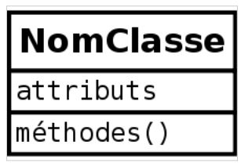
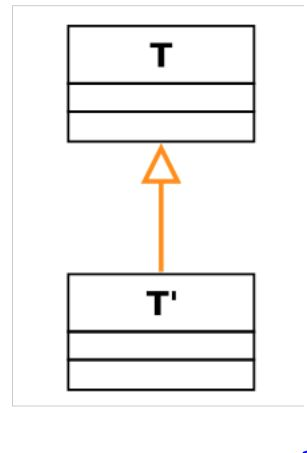
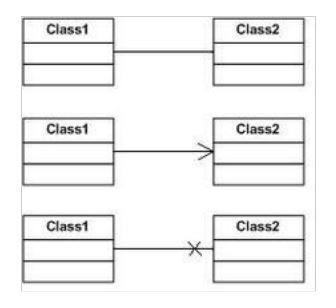
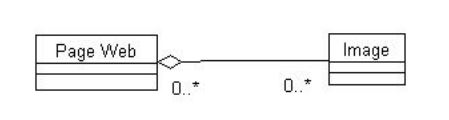
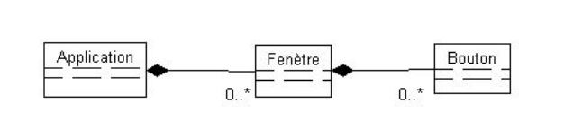
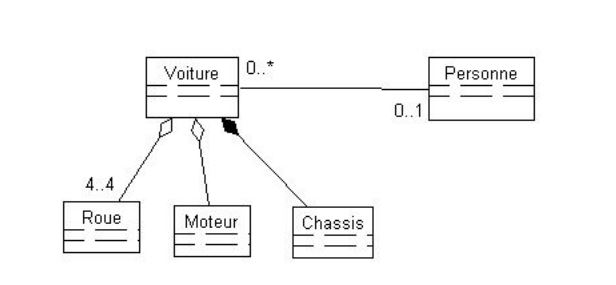
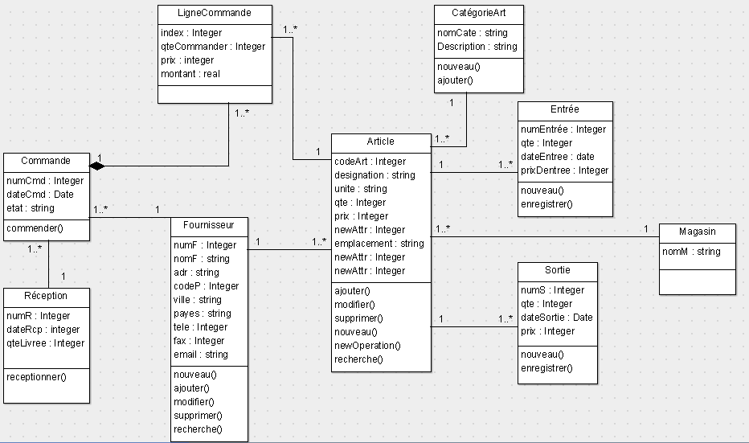

## Le diagramme de classe
Une classe est représentée par un rectangle séparé en trois parties : 

● **la première partie** contient le nom de la classe 
● **la seconde contient** les attributs de la classe 
● **la dernière contient** les méthodes de la classe

## le nom de la classe

 **Dans une classe classique**, le nom est écrit en romain (exemple : « ClasseClassique »). 
 **Le nom des classes abstraites** est écrit en italique (exemple : « ClasseAbstraite »). 

## les attributs de la classe
`Visibilité nomAttribut [multiplicité] : typeAttribut = Initialisation ;` 
**Visibilité**

 - **(+)** accès public 
 -  **(#)** accès protégé 
 -  **(~)** accès package 
 -  **(- )** accès privé

## les méthodes

La syntaxe d'une méthode est la suivante : 

    Visibilité nomFonction(directionParamètreN nomParamètreN : typeParamètreN) : typeRetour 

**Exemples de méthode**

 - **méthode publique** getAge() retournant un entier

     +getAge() : int 

 - **méthode protégée** calculerAge() prenant comme paramètre dateNaissance de type Date et ne retournant rien (void)
 
    #calculerAge(in dateNaissance : Date) : void

## Relations entre les classes

## Héritage

## Association
**multiplicité :** 
comparable aux cardinalités du système Merise, sert à compter le nombre minimum et maximum d'instances de chaque classe dans la relation liant 2 ou plusieurs classes. 
 - 1..1 ou 1 Un et un seul 
 - 0..1 zéro ou un seul 
 - 0..* ou * zéro à plusieurs 
 - 3..4 trois à quatre  
 - 4 quatre et seulement quatre
 
**navigabilité :** 

 - Bidirectionnelle
 - Mono-directionnelle, Invocation de méthode
 - interdit une association.

## Agrégation

- Une page peut contenir des images mais celles-ci peuvent appartenir à d'autres pages.
-   la destruction d'une page n'entraîne pas celle de l'image mais seulement la suppression du lien. 
- Bien sûr nous aurons très souvent une cardinalité 1..1 ou 0..1 côté agrégat. 

L'appartenance est dite faible car l'agrégé pourra participer à d'autres agrégats et son cycle de vie n'est pas subordonné à celui de son agrégat. **Plus haut la disparition d'une configuration n'entraîne pas la disparition des périphériques.**

## Composition
La composition est une agrégation avec cycle de vie dépendant : la classe composée est détruite lorsque la classe mère disparait.

 - La composition se modélise par un losange noir côté composé. 
 - Une application contient de 0 à n fenêtres qui contiennent de 0 à n boutons. 
 - La fermeture de l'application entraîne la destruction des fenêtres qui entraîne la destruction des boutons. 
 - la non-présence des valeurs de multiplicités est synonyme de 1..1

## Exemple

- Le châssis est un élément indissociable d'une voiture, d'où la composition. 
- Le moteur et les roues peuvent être utilisés dans d'autres voitures. 
- Notez les valeurs 4..4 qui caractérisent plus précisément les valeurs de multiplicité 
- Les absences de cardinalité sont assimilable à 1..1 
- L'association entre Voiture et Personne n'est pas nommée, cela est conseillé lorsque son nom est trivial: "appartient", "concerne" etc ...afin de na pas alourdir le modèle, sans rien apporter à la sémantique.

## Gestion de stock
