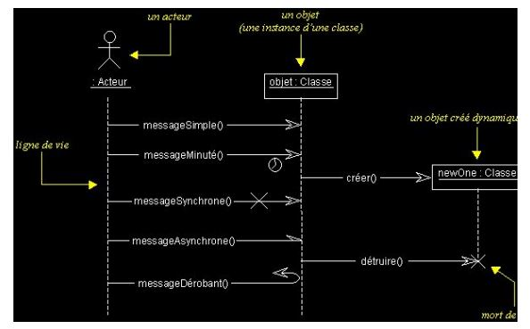
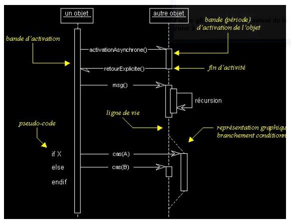

## DIAGRAMME DE SEQUENCE

 ● Les diagrammes de séquences permettent de représenter des collaborations entre objets selon un point de vue temporel, on y met l'accent sur la chronologie des envois de messages.
  ● Les diagrammes de séquences peuvent servir à illustrer un cas d'utilisation. 

## Activation d'un objet

 Sur un diagramme de séquence, il est aussi possible de représenter de manière explicite les différentes périodes d'activité d'un objet au moyen d'une bande rectangulaire superposée à la ligne de vie de l'objet. 
  