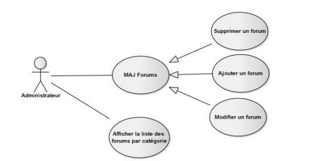

## Le diagramme de cas d'utilisation

 Les diagrammes de cas d'utilisation sont des diagrammes UML utilisés **pour donner une vision globale du comportement fonctionnel d'un système logiciel.** 
Cas d'utilisation Ils permettent de décrire l'interaction entre l'acteur et le système. 

## Le cas d'utilisation

Un cas d'utilisation est une unité cohérente **représentant une fonctionnalité visible de l'extérieur.**

## Acteurs

 Ils sont des entités externes qui interagissent avec le système, comme une personne humaine ou un robot. 
 

## Relations

**Inclusions**
**Lorsque A est sollicité, B l'est obligatoirement, comme une partie de A.**
Cette dépendance est symbolisée par le stéréotype << include >>. Par exemple, l'accès aux informations d'un compte bancaire inclut nécessairement une phase d'authentification avec un
identifiant et un mot de passe .

**Extension**
On dit qu'un cas d'utilisation A étend un cas d'utilisation B lorsque le cas d'utilisation A peut être appelé au cours de l'exécution du cas d'utilisation B. 
 Cette dépendance est symbolisée par le stéréotype << extend >> .
 
 **Généralisations**
 

## Relations entre acteurs
